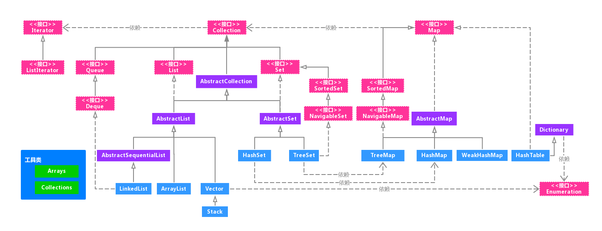

### Java集合总览

------

Java 集合工具包位于 Java.util 包下，包含了很多常用的数据结构，如数组、链表、栈、队列、集合、哈希表等。学习Java集合框架下大致可以分为如下五个部分：List 列表、Set 集合、Map 映射、迭代器（Iterator、Enumeration）、工具类（Arrays、Collections）。

Java集合类的整体框架如下：

从上图中可以看出，集合类主要分为两大类：`Collection`和`Map`。

Collection 是 List、Set 等集合高度抽象出来的接口，它包含了这些集合的基本操作，它主要又分为两大部分：List 和 Set。

`List`接口通常表示一个列表（数组、队列、链表、栈等），其中的元素可以重复，常用实现类为`ArrayList`和`LinkedList`，另外还有不常用的`Vector`。另外，LinkedList 还是实现了 Queue 接口，因此也可以作为队列使用。

`Set`接口通常表示一个集合，其中的元素不允许重复（通过`hashcode`和`equals`函数保证），常用实现类有`HashSet`和`TreeSet`，HashSet 是通过 Map 中的 HashMap 实现的，而 TreeSet 是通过 Map 中的 TreeMap 实现的。另外，TreeSet 还实现了`SortedSet`接口，因此是有序的集合（集合中的元素要实现`Comparable`接口，并覆写`Compartor`函数才行）。

我们看到，抽象类`AbstractCollection`、`AbstractList`和`AbstractSet`分别实现了`Collection`、`List`和`Set`接口，这就是在 Java 集合框架中用的很多的`适配器设计模式`，用这些抽象类去实现接口，在抽象类中实现接口中的若干或全部方法，这样下面的一些类只需直接继承该抽象类，并实现自己需要的方法即可，而不用实现接口中的全部抽象方法。

`Map`是一个映射接口，其中的每个元素都是一个`key-value键值对`，同样抽象类`AbstractMap`通过适配器模式实现了Map接口中的大部分函数，`TreeMap`、`HashMap`、`WeakHashMap`等实现类都通过继承`AbstractMap`来实现，另外，不常用的`HashTable`直接实现了 Map 接口，它和 Vector 都是 JDK 1.0 就引入的集合类。

`Iterator`是遍历集合的迭代器（不能遍历 Map，只用来遍历 Collection），Collection 的实现类都实现了`iterator()`函数，它返回一个 Iterator 对象，用来遍历集合，`ListIterator`则专门用来遍历 List。而`Enumeration`则是 JDK 1.0 时引入的，作用与 Iterator 相同，但它的功能比 Iterator 要少，它只能再 Hashtable、Vector 和 Stack 中使用。

`Arrays`和`Collections`是用来操作数组、集合的两个工具类，例如在 ArrayList 和 Vector 中大量调用了`Arrays.Copyof()`方法，而 Collections 中有很多静态方法可以返回各集合类的 synchronized 版本，即线程安全的版本，当然了，如果要用线程安全的结合类，首选`Concurrent`并发包下的对应的集合类。